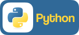
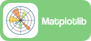

## 🏌️Nathan Brasse

<b>""The best way to have good ideas is to have lots of ideas.""</b>  - <i>Linus Pauling</i>

I'm an indie data analyst and writer who builds end-to-end solutions from the ground up. Each project starts with a business question and a blank whiteboard and ends with something real, whether it's a deployed model, an automated workflow, or an analysis that drives action. I focus on impact, aligning with stakeholders early and making technical results clear and useful for decision-makers.

### 🌱 Currently

- 📕 Taking the Honors Bachelors of Data Science and Analytics Program at Seneca.

### 🧰 Tools

    
    
    
    
    
    
    
    
    
    
    
    
    

 
 

<!--
**nathanbrasse/nathanbrasse** is a ✨ _special_ ✨ repository because its `README.md` (this file) appears on your GitHub profile.

Here are some ideas to get you started:

- 🔭 I’m currently working on ...
- 🌱 I’m currently learning ...
- 👯 I’m looking to collaborate on ...
- 🤔 I’m looking for help with ...
- 💬 Ask me about ...
- 📫 How to reach me: ...
- 😄 Pronouns: ...
- ⚡ Fun fact: ...

### 🌱 Current Projects

### ⚡ Extras:
##### 🏆2025 Seneca Hackathon Winner

**Winner - Food Insecurity and Charitable Support**
Prototyped a native app to help organizations connect with volunteers. Focused on improving volunteer retention and easing pressure on supply chains through thoughtful feature design.

-->
